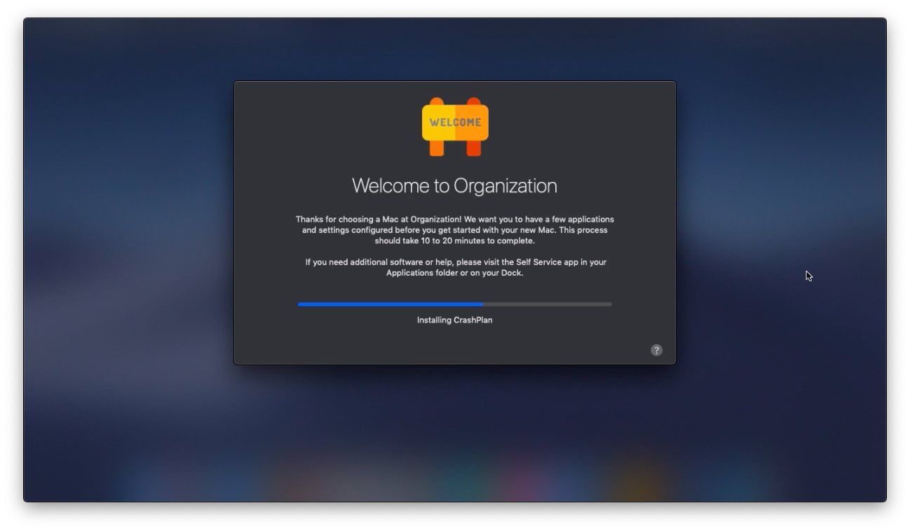

# DEPNotify Starter for Jamf Pro
Template bash script to start DEPNotify and run Policies during enrollment with Jamf. App installer, source code, and full product documentation can be found at: https://gitlab.com/Mactroll/DEPNotify

## General Information

**Please review [RELEASES.md](RELEASES.md) to ensure proper version pairing of the script and DEPNotify app.**

This script is designed to make implementation of DEPNotify very easy with limited scripting knowledge. The script has variables that may be modified to customize the end user experience. DO NOT modify things in or below the CORE LOGIC areas unless major testing and validation is performed.

**This script is set to `TESTING_MODE` by default.**

There is a [warning alert box](example-img/fullscreen_testing_mode.png) that will show if `TESTING_MODE` is set to `true` in version 1.2.0 and later. Having testing mode on will cause the following things to occur:

* Sleep commands in place of running policies or other things that may effect the device configuration
* Removal of BOM and configuration files
* Command + Control + x is set to quit or interrupt DEPNotify

The script will need to be changed from `TESTING_MODE=true` to `TESTING_MODE=false` for production deployment.

**It is recommended that you read the script fully and make changes that suit your organization prior to deployment to end user devices. Also, don't forget to test, test, and test again!**

## Configuration within Jamf Pro

While each organization will use a setup tool like DEPNotify differently, this script is designed with an end user provisioning model in mind. Changing the workflow should result in testing prior to production release.

1. [Create policies](example-img/jamfpro_policy_configuration.png) in Jamf Pro to install core software during first setup. Set the frequency to ongoing and the trigger to custom and type in a manual trigger. Screenshot below showing how a single policy is configured
2. Once software policies are created, customize this script with changes to verbiage as well as updating the POLICY_ARRAY with appropriate information. Double check the testing flag once you are ready to proceed
  * (Optional) If using the [EULA window](example-img/fullscreen_eula_user_input.png), there must be a .txt file saved somewhere locally prior to DEPNotify running. A by default, the script is looking in /Users/Shared for eula.txt
  * (Optional) If using the [registration window](example-img/fullscreen_register_user_input.png), you must have the departments and buildings in Jamf prior to running DEPNotify on the client. Each text box or drop down has its own code so that it can be modified to suit individual needs. Make sure to test a bunch if the logic sections are changed
3. Upload DEPNotify.pkg (downloaded from https://gitlab.com/Mactroll/DEPNotify/tags) and this script to Jamf Pro. Create a policy to install the PKG and this script using the Enrollment Complete trigger. Also set the execution frequency to ongoing
  * (Optional) If using the EULA, add the EULA.pkg built in step 2 to this policy as well
  * (Optional) [Policy parameters](example-img/jamfpro_policy_parameter_values.png) can be used to configure true/false flags to make testing features easier
4. Once a computer is finished enrolling, the DEPNotify policy will start and then call the other policies in order based on the array.

#### FileVault Support

If you are requiring FileVault encryption, the script will automatically check at the end of running policies if deferred enablement is on. This will trigger a logout instead of a quit of DEPNotify.

#### Additional Information

For this script, verbose comments have been added to assist in configuration and understanding. For more information on DEPNotify, visit https://gitlab.com/Mactroll/DEPNotify

## Software Versions and Releases

Software versions started to get rather cumbersome as versions of the script deviated from the app's version. Documentation of the script to app testing as well as macOS versions can now be found on the [RELEASES.md](RELEASES.md) file.

## Change Log

The change log was getting a bit long and now has moved to its own page. Please visit the [CHANGELOG.md](CHANGELOG.md) for more information.

## Contributors

This project could not have happened without several people's assistance. A special thanks to those individuals can be found on [CONTRIBUTORS.md](CONTRIBUTORS.md)

## Migration

This project was moved from https://github.com/jamfprofessionalservices/DEPNotify
